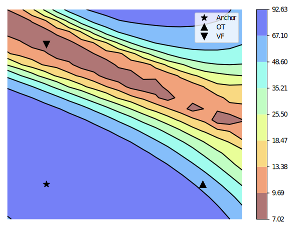

# Transformer Fusion with Optimal Transport

#### *Published as a conference paper at ICLR 2024*

### Moritz Imfeld*, Jacopo Graldi*, Marco Giordano*, Thomas Hofmann, Sotiris Anagnostidis and Sidak Pal Singh

#### *ETH Zurich, Switzerland*


*Transportation Map Flow Graph of the Self-Attention*




*Accuracy Landscapes of the anchor, one-shot OT, and VF fused models*

## Abstract

Fusion is a technique for merging multiple independently-trained neural networks in order to combine their capabilities. Past attempts have been restricted to the case of fully-connected, convolutional, and residual networks. In this paper, we present a systematic approach for fusing two or more transformer-based networks exploiting Optimal Transport to (soft-)align the various architectural components. We flesh out an abstraction for layer alignment, that can generalize to arbitrary architectures -- in principle -- and we apply this to the key ingredients of Transformers such as multi-head self-attention, layer-normalization, and residual connections, and we discuss how to handle them via various ablation studies. Furthermore, our method allows the fusion of models of different sizes (\textit{heterogeneous fusion}), providing a new and efficient way for the compression of Transformers. The proposed approach is evaluated on both image classification tasks via Vision Transformer and natural language modeling tasks using BERT. Our approach consistently outperforms vanilla fusion, and, after a surprisingly short finetuning, also outperforms the individual converged parent models.
In our analysis, we uncover intriguing insights about the significant role of soft alignment in the case of Transformers. Our results showcase the potential of fusing multiple Transformers, thus compounding their expertise, in the budding paradigm of model fusion and recombination.

---

## How to run a Transformer Fusion experiment

1. **Clone the repository**

```
git clone https://github.com/graldij/transformer-fusion
```

2. **Using `Python 3.9`, install the required packages**

```
pip install -r requirements.txt
```

3.  **Download the zipped folder with the two Transformer models from this [link](https://drive.google.com/file/d/1ez2VqveQSJyBJ0WlzdrsFetoIruZU4Ph/view?usp=sharing) and extract the `models` folder into root of the repository.**

4. **Run the `main.py` script as follows:**
```
python main.py fuse_hf_vit_cifar10.yaml
```

---

## Code Structure

This section offers a high-level overview of the code implementation.

In general, the fusion pipeline (implemented in [`main.py`](main.py)) can be divided into three steps:

1. Preparation
2. Fusion
3. Evaluation

### Preparation
The program first loads the experiment configuration (specified by the `.yaml` file passed to the run command). The experiment configuration precisely defines the experiment and is used in every step of the execution pipeline.

Then, the program loads the dataset and models. Once the models are loaded, nested dictionaries containing all the weights and biases of each model are created.

Example of how a model layer is turned into a nested dictionary:

```
Layer name: "vit.some.layer"
Nested dictionary:  {vit: {some: {layer: {weights: [x, y], bias: [z]}}}}
```

The fusion algorithm will then operate on these nested dictionaries.

Finally, the activations needed for fusion are computed. The activations are also stored in a nested dictionary with an identical structure as the weight dictionaries.

### Fusion
In [`main.py`](main.py), fusion via optimal transport is simply a function call. However, under the hood we created a library of functions ([`otfusion_lib.py`](otfusion/otfusion_lib.py)) that can perform optimal transport based fusion. [`otfusion_lib.py`](otfusion/otfusion_lib.py) contains functions to fuse feed-forward layers, normalization layers, attention-layers and encoder layers. Furthermore, some functions can handle the transportation map flow through residual connections. Using these library functions one can write a function that fuses specific transformer implementations. For example, [`hf_vit_fusion.py`](otfusion/hf_vit_fusion.py) can fuse the Hugging Face ViT implementation.

The fusion function returns a nested dictionary containing the fused weights. These are then converted back into a transformer model.

The fusion step in [`main.py`](main.py) also performs vanilla fusion (VF).

### Evaluation
The evaluation step evaluates and reports the accuracies of the parent models, the model fused with optimal transport and the model fused with VF.


## Citation

```bibtex
@inproceedings{imfeld2024transformerfusion,
  title={Transformer Fusion with Optimal Transport},
  author={Imfeld, Moritz and Graldi, Jacopo and Giordano, Marco and Hofmann, Thomas and Anagnostidis, Sotiris and Singh, Sidak Pal},
  booktitle={International Conference on Learning Representations},
  year={2024},
  url={https://openreview.net/forum?id=LjeqMvQpen}
}
```
